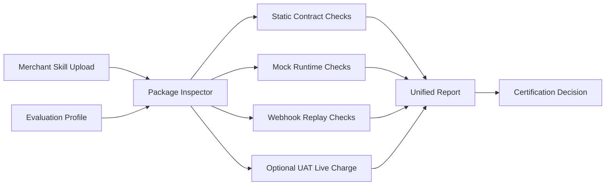

# Clink Official Agent Payment Skill Evaluation System

## Goal

When a merchant uploads a skill that claims Clink Agent Payment support, Clink should automatically produce a useful certification report:

- whether the skill can use Clink Agent Payment safely
- which required capabilities are missing
- whether the issue is merchant package, Clink runtime setup, merchant verifier, or environment mismatch
- what the merchant should fix next

The evaluator must be merchant-generic. Merchant-specific data is limited to a standard evaluation profile, not custom evaluator code.

## Core Architecture

## Evaluation Layers

### L0 Static Package Evaluation

No network calls and no charges.

Checks:

- package structure
- secrets
- merchant id / amount / currency declaration
- payment runtime dependency
- wallet and card readiness instructions
- exact-charge authorization
- payment handoff contract
- merchant confirmation contract
- failure semantics
- environment consistency

This layer is implemented in `bin/evaluate.mjs`.

### L1 Mock Runtime Evaluation

Future layer.

Runs the merchant skill in an instrumented sandbox where Clink payment calls are mocked. The harness records whether the agent attempts the correct operations in the correct order:

1. pre-check wallet
2. require card readiness
3. ask or verify exact authorization
4. call `clink_pay` with correct `merchant_integration`
5. preserve `payment_handoff`
6. wait for merchant confirmation before task resume

This validates behavior, not just documentation.

### L2 Webhook Replay Evaluation

Future layer.

Replays standard Clink events:

- `payment_method.added`
- `payment_method.defaultChange`
- `risk_rule.updated`
- `agent_order.succeeded`
- `agent_order.failed`
- `agent_refund.succeeded`
- `agent_refund.failed`

The harness checks card ownership, idempotency, duplicate delivery tolerance, pending confirmation cleanup, and exactly-once merchant confirmation.

### L3 UAT Live Charge Evaluation

Optional and guarded by `--allow-charge`.

Requires pre-provisioned UAT assets:

- merchant id
- verifier-approved customer email
- bound UAT payment method
- optional merchant confirmation probe

This layer proves that the integration works end-to-end in Clink UAT. It should be used for final certification or nightly regression, not every upload.

## Standard Evaluation Profile

The profile is the key to generic automation.

It declares:

- expected Clink merchant id
- amount
- currency
- merchant API base URL for environment consistency
- UAT customer email for live tests
- merchant integration server/tool
- optional confirmation probe

The JSON Schema is in `schema/evaluation-profile.schema.json`.

## Certification Decision

Current prototype:

- `certified`: score >= 90, no blocker/fail
- `conditional`: score >= 70, no blocker
- `not_certified`: otherwise

Recommended production policy:

- all P0 checks must pass
- L0 must pass before L1/L2
- L3 is required for official "Clink Verified" badge
- L3 may be skipped for documentation-only partner reviews

## Why PollyReach Failed Before Registration

The PollyReach case exposed a generic class of failure:

- Clink UAT merchant verifier pointed to `https://api-test.pollyreach.ai`
- uploaded skill/runtime used `https://api.pollyreach.ai`
- the customer email was registered in one environment but not the other
- Clink correctly sent `customerEmail`, but merchant verifier returned `verified=false`

This is now covered by `environment.consistency`.

## Productionization Plan

1. Add profile validation before evaluation.
2. Replace regex-only static checks with AST/manifest parsers where package format is standardized.
3. Add mock Clink MCP server for L1.
4. Add webhook replay runner for L2.
5. Add isolated UAT tenant/test customer pool for L3.
6. Store reports as signed JSON artifacts.
7. Surface merchant-friendly remediation text in Dashboard.
